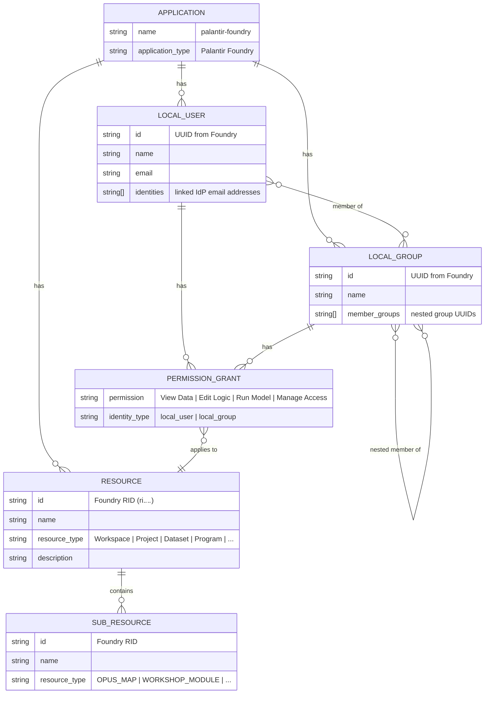
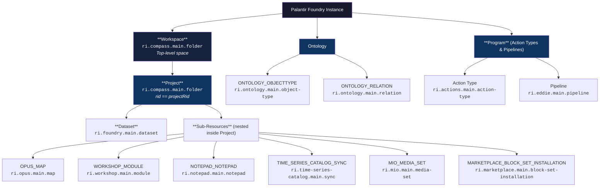
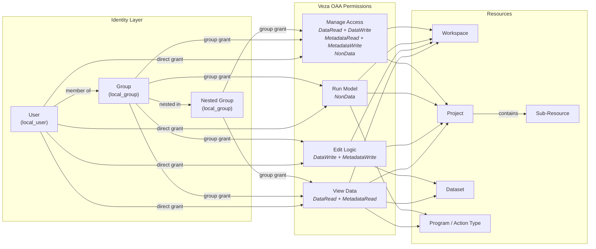

# Palantir Foundry to Veza OAA Integration

## Overview

This integration script collects identity, access control, and Ontology information from **Palantir Foundry** and pushes it to **Veza** via the Open Authorization API (OAA). The connector provides read-only visibility into:

- **Users** — All platform users with email and identity linkage
- **Groups** — All platform groups with full membership graphs (including nested groups)
- **Workspaces** — Top-level spaces (filesystem root containers)
- **Projects** — Organisational project folders within spaces
- **Datasets** — Data assets with metadata
- **Resources** — Other filesystem objects (notebooks, code repos, etc.)
- **Action Types** — Ontology action types (create/edit/delete workflows), with per-principal access policies
- **Access Policies** — Role grants on all resource types, mapped to Veza permissions

All data flows through Veza's OAA model, enabling centralised visibility into identity, access, and Ontology governance across your Palantir Foundry deployment.

---

## How It Works

The integration follows this five-step flow:

1. **Authenticate** — Validates credentials against `GET /api/v2/admin/users?pageSize=1`
2. **Collect identity data** — Fetches all users, groups, and group memberships (including nested)
3. **Collect resource data** — Traverses filesystem spaces → projects → datasets; also fetches Ontology action types via `GET /api/v1/ontologies/{rid}/actionTypes`
4. **Fetch access policies** — Calls `GET /api/v2/filesystem/resources/{rid}/roles` for every resource and action type RID
5. **Build & push payload** — Constructs a Veza `CustomApplication` and pushes via OAA client; optionally saves the JSON payload for inspection

---

## Prerequisites

### System Requirements
- **OS**: Linux (RHEL/CentOS, Ubuntu, Debian), macOS, or Windows with Python
- **Python**: 3.9 or higher
- **Internet Access**: HTTPS connectivity to Palantir Foundry and Veza instances
- **Disk Space**: ≥ 500 MB (for virtual environment and logs)
- **Network Firewall**: Outbound HTTPS (port 443) allowed

### Palantir Foundry Prerequisites
- **Active Palantir Foundry instance** (e.g. `https://your-company.palantirfoundry.com`)
- **API Token** with at minimum `api:admin-read` and `api:ontologies-read` scopes
- **Required API Endpoints**:
  - `GET /api/v2/admin/users` — list all users (paginated)
  - `GET /api/v2/admin/groups` — list all groups (paginated)
  - `GET /api/v2/admin/groups/{id}/groupMembers` — group membership
  - `GET /api/v2/filesystem/spaces` — list top-level spaces
  - `GET /api/v2/filesystem/folders/{rid}/children` — recursive filesystem traversal
  - `GET /api/v2/filesystem/resources/{rid}/roles` — resource role grants
  - `GET /api/v1/ontologies` — list Ontologies
  - `GET /api/v1/ontologies/{rid}/actionTypes` — list action types (paginated)

### Veza Prerequisites
- **Active Veza instance** with API access enabled
- **Valid API key** with permissions to push OAA data
- **Network connectivity** from integration server to Veza instance
- **Supported Veza version**: 6.0 or higher

### Network Requirements
```
Outbound HTTPS (port 443) to:
  - Palantir Foundry: your-company.palantirfoundry.com
  - Veza instance: your-veza-domain.veza.com
  - PyPI (for package installation): pypi.org, pypi.python.org

Optional:
  - Firewall rules limiting access to service account IP
  - Proxy configuration if environment requires
```

---

## Quick Start

### One-Command Installation (Interactive - Linux/macOS)

```bash
curl -fsSL https://raw.githubusercontent.com/pvolu-vz/PALANTIR-FOUNDRY/main/integrations/palantir-foundry/install_palantir_foundry.sh | bash
```

The installer will:
1. Check system dependencies (Python 3.9+, Git)
2. Clone the integration repository
3. Create a Python virtual environment
4. Prompt for Palantir Foundry and Veza credentials
5. Generate a `.env` file with configuration
6. Test the connection to Palantir Foundry
7. Create a wrapper script for cron scheduling

---

## Manual Installation

### Step 1: Clone the Repository

```bash
git clone https://github.com/pvolu-vz/PALANTIR-FOUNDRY.git
cd PALANTIR-FOUNDRY/integrations/palantir-foundry
```

### Step 2: Create Python Virtual Environment

**Linux/macOS:**
```bash
python3 -m venv venv
source venv/bin/activate
```

**Windows (PowerShell):**
```powershell
python -m venv venv
.\venv\Scripts\Activate.ps1
```

### Step 3: Install Dependencies

```bash
pip install --upgrade pip setuptools wheel
pip install -r requirements.txt
```

### Step 4: Configure Credentials

Copy the template configuration file:
```bash
cp .env.template .env
```

Edit `.env` with your credentials:
```bash
# Palantir Foundry Configuration
FOUNDRY_BASE_URL=https://your-company.palantirfoundry.com
FOUNDRY_API_TOKEN=your_api_token_here

# Veza Configuration
VEZA_URL=https://your-veza-instance.veza.com
VEZA_API_KEY=your_api_key_here
```

### Step 5: Run a dry-run

```bash
python3 palantir_foundry.py --dry-run --save-json --log-level DEBUG
```

This connects to Foundry, builds the full OAA payload, and saves it as `palantir-foundry_oaa_payload.json` — without pushing to Veza.

### Step 6: Run the full integration

```bash
# Push to Veza and save payload JSON
python3 palantir_foundry.py --save-json

# Custom env file
python3 palantir_foundry.py --env-file /path/to/.env --save-json
```

---

## Usage

### Command-Line Options

| Flag | Default | Description |
|------|---------|-------------|
| `--env-file PATH` | `.env` | Path to .env configuration file |
| `--foundry-url URL` | — | Override `FOUNDRY_BASE_URL` |
| `--foundry-token TOKEN` | — | Override `FOUNDRY_API_TOKEN` |
| `--veza-url URL` | — | Override `VEZA_URL` |
| `--veza-api-key KEY` | — | Override `VEZA_API_KEY` |
| `--provider-name NAME` | `Palantir Foundry` | Provider label in Veza UI |
| `--datasource-name NAME` | `palantir-foundry` | Datasource label in Veza UI |
| `--dry-run` | off | Build payload without pushing to Veza |
| `--save-json` | off | Save OAA payload as JSON for inspection |
| `--log-level LEVEL` | `INFO` | `DEBUG`, `INFO`, `WARNING`, or `ERROR` |

### Example: Dry-run (no Veza push)

```bash
python3 palantir_foundry.py --dry-run --save-json --log-level DEBUG
```

### Example: Full push with JSON saved

```bash
python3 palantir_foundry.py --save-json
```

### Example: Custom env file

```bash
python3 palantir_foundry.py --env-file /path/to/.env.prod --save-json
```

---

## Scheduling with Cron

### Linux/macOS Cron

To run the integration automatically, add a cron job:

```bash
# Open crontab editor
crontab -e

# Add entry to run daily at 2 AM
0 2 * * * cd /home/user/palantir-foundry-veza/integrations/palantir-foundry && source venv/bin/activate && python3 palantir_foundry.py >> integration.log 2>&1

# Run every 6 hours
0 */6 * * * cd /home/user/palantir-foundry-veza/integrations/palantir-foundry && source venv/bin/activate && python3 palantir_foundry.py >> integration.log 2>&1

# Run hourly
0 * * * * cd /home/user/palantir-foundry-veza/integrations/palantir-foundry && source venv/bin/activate && python3 palantir_foundry.py >> integration.log 2>&1
```

### Windows Task Scheduler

1. Open Task Scheduler
2. Create Basic Task
3. Set trigger (Daily at 2 AM, etc.)
4. Set action:
   - Program: `C:\path\to\venv\Scripts\python.exe`
   - Arguments: `C:\path\to\palantir_foundry.py`
   - Start in: `C:\path\to\integration\directory`
5. Configure credentials to run as service account

---

## Logs and Monitoring

### Log Files

The integration generates detailed logs in two locations:

```
# Console output
STDOUT / STDERR

# File logs (in integration directory)
palantir_foundry_veza_integration.log
```

### Log Levels

Pass `--log-level DEBUG|INFO|WARNING|ERROR` at runtime. Default is `INFO`.

```bash
python3 palantir_foundry.py --log-level DEBUG --save-json
```

### Log Format

Logs are written to `logs/palantir_foundry_<DDMMYYYY-HHMM>.log` with hourly rotation (24 files kept).

```
2026-04-30T17:20:41 INFO     Loaded .env from .env
2026-04-30T17:20:41 INFO     Connecting to Palantir Foundry at https://your-company.palantirfoundry.com
2026-04-30T17:20:41 INFO     Successfully authenticated with Palantir Foundry
2026-04-30T17:20:42 INFO     Retrieved 2341 users
2026-04-30T17:20:46 INFO     Retrieved 496 groups
2026-04-30T17:20:47 INFO     Fetched 0 role definitions
2026-04-30T17:49:11 INFO     Fetching action types...
2026-04-30T17:49:11 INFO     Retrieved 1735 action types
2026-04-30T17:49:36 INFO     Successfully pushed to Veza
```

---

## Troubleshooting

### Authentication Errors

**Error**: `Failed to connect to Palantir Foundry`

**Solutions**:
1. Verify `FOUNDRY_API_TOKEN` is valid and not expired
2. Token must have at minimum `api:admin-read` and `api:ontologies-read` scopes
3. Verify `FOUNDRY_BASE_URL` does not have a trailing slash
4. Test connectivity: `curl -H "Authorization: Bearer YOUR_TOKEN" https://your-company.palantirfoundry.com/api/v2/admin/users?pageSize=1`

### Network Errors

**Error**: `Connection timeout`, `Failed to connect to Palantir Foundry`

**Solutions**:
1. Verify internet connectivity: `ping your-company.palantirfoundry.com`
2. Check firewall rules allow HTTPS (port 443) outbound
3. If using proxy, configure environment variables:
   ```bash
   export HTTP_PROXY=http://proxy.company.com:8080
   export HTTPS_PROXY=https://proxy.company.com:8080
   ```
4. Test with curl: `curl -v https://your-company.palantirfoundry.com/api/v2/admin/users?pageSize=1`

### Veza Push Errors

**Error**: `Failed to push to Veza`

**Solutions**:
1. Verify `VEZA_API_KEY` is valid and has OAA push permissions
2. Check `VEZA_URL` includes the scheme (`https://`) and no trailing slash
3. Test: `curl -H "Authorization: Bearer YOUR_KEY" https://your-veza.veza.com/api/v1/providers`
4. Run `--dry-run --save-json` to confirm the payload builds successfully before attempting another push
5. Verify `oaaclient` version: `pip show oaaclient`

### Missing Data

**Issue**: Fewer resources than expected appear in Veza

**Solutions**:
1. Run with `--dry-run --save-json --log-level DEBUG` and inspect the saved JSON payload
2. Filesystem resources (spaces, projects, datasets) require filesystem scope on the token — check logs for `400 Bad Request` on `/api/v2/filesystem/spaces`
3. Action types require `api:ontologies-read` scope — check logs for `403` or `0 action types`
4. Review DEBUG logs for per-endpoint errors
5. Check that the token account is not restricted to a subset of Foundry projects

### Python Version Issues

**Error**: `ModuleNotFoundError: No module named 'oaaclient'`

**Solutions**:
1. Ensure virtual environment is activated: `source venv/bin/activate`
2. Reinstall dependencies: `pip install -r requirements.txt`
3. Check Python version: `python3 --version` (must be 3.9+)
4. Clear pip cache: `pip cache purge`

---

## Configuration Reference

### Environment Variables

| Variable | Required | Description | Example |
|----------|----------|-------------|---------|
| `FOUNDRY_BASE_URL` | Yes | Base URL of Palantir Foundry instance | `https://your-company.palantirfoundry.com` |
| `FOUNDRY_API_TOKEN` | Yes | Bearer token for Foundry API auth | `eyJwbG50ci...` |
| `VEZA_URL` | Yes | Base URL of Veza instance | `https://your-instance.vezacloud.com` |
| `VEZA_API_KEY` | Yes | API key for Veza OAA push | `k1Mx...` |

### File Structure

```
palantir-foundry/
├── palantir_foundry.py              # Main integration script
├── requirements.txt                 # Python dependencies
├── .env.template                    # Credential template (no real values)
├── .env                             # Active config (git-ignored)
├── install_palantir_foundry.sh      # One-command installer
├── preflight.sh                     # Pre-deployment validation script
├── README.md                        # This file
├── logs/                            # Rotating log files (git-ignored)
│   └── palantir_foundry_<DDMMYYYY-HHMM>.log
├── samples/                         # Sample source data for dry-run testing
└── venv/                            # Python virtual environment (git-ignored)
```

---

## API Rate Limiting

Palantir Foundry and Veza both enforce API rate limits:

- **Palantir Foundry**: 
  - Read endpoints: typically 100-1000 requests per minute
  - Pagination: up to 1000 items per page

- **Veza OAA**: 
  - Push endpoint: depends on data size and instance

The integration includes automatic pagination handling and retry logic for transient failures.

---

## Data Model

### OAA Entity Relationship

The diagram below shows how all Palantir Foundry entities are structured within Veza's OAA `CustomApplication` model.



---

### Foundry Resource Type Taxonomy

Foundry resources are identified by RID prefix. This diagram shows how each RID namespace maps to a resource type in the OAA payload, and where resources appear in the filesystem hierarchy.



---

### Permission Assignment Flow

This diagram shows how Foundry role grants translate into Veza permissions, and how users inherit access through group membership — including nested groups.



---

## Data Mapping

### Entity Mapping

| Palantir Foundry | Veza OAA Type | RID Prefix | Notes |
|-----------------|---------------|------------|-------|
| User | Local User | — | Email linked to IdP identity |
| Group | Local Group | — | Nested group memberships included |
| Space | Resource — Workspace | `ri.compass.main.folder` | Top-level filesystem container |
| Project folder | Resource — Project | `ri.compass.main.folder` | Identified by `rid == projectRid` |
| Dataset | Resource — Dataset | `ri.foundry.main.dataset` | Includes `row_count` property |
| Ontology Action Type | Resource — Program | `ri.actions.main.action-type` | Includes `api_name`, `status`, `description` |
| Pipeline | Resource — Program | `ri.eddie.main.pipeline` | Transform and ETL pipelines |
| Ontology Object Type | Resource — ONTOLOGY_OBJECTTYPE | `ri.ontology.main.object-type` | Ontology entity definitions |
| Ontology Relation | Resource — ONTOLOGY_RELATION | `ri.ontology.main.relation` | Ontology relationship links |
| Workshop Module | Resource — WORKSHOP_MODULE | `ri.workshop.main.module` | Application dashboards |
| Notepad | Resource — NOTEPAD_NOTEPAD | `ri.notepad.main.notepad` | Documentation assets |
| Media Set | Resource — MIO_MEDIA_SET | `ri.mio.main.media-set` | Binary media collections |
| Time Series Sync | Resource — TIME_SERIES_CATALOG_SYNC | `ri.time-series-catalog.main.sync` | Time series integrations |
| Marketplace Installation | Resource — MARKETPLACE_BLOCK_SET_INSTALLATION | `ri.marketplace.main.block-set-installation` | Installed Marketplace bundles |
| Map (sub-resource) | Sub-Resource — OPUS_MAP | `ri.opus.main.map` | Geospatial map objects nested in a Project |

### Permission Mapping

Foundry role UUIDs are mapped to Veza custom permissions by matching keywords in the role display name:

| Foundry Role Keywords | Veza Permission | OAA Capabilities |
|-----------------------|-----------------|------------------|
| `owner`, `admin`, `administer` | `owner` | DataRead, DataWrite, MetadataRead, MetadataWrite, NonData |
| `editor`, `write`, `edit` | `editor` | DataRead, DataWrite, MetadataRead |
| `discover` | `discoverer` | MetadataRead |
| `viewer`, `view`, `read` (default) | `viewer` | DataRead, MetadataRead |
| (action type access) | `can_apply` | NonData, MetadataRead |
| (platform admin) | `admin` | DataRead, DataWrite, MetadataRead, MetadataWrite |

The four OAA permissions visible in Veza map to Foundry role semantics as follows:

| Veza Permission | OAA Capabilities | Foundry Equivalent |
|-----------------|------------------|--------------------|
| View Data | DataRead, MetadataRead | Viewer / Discover role |
| Edit Logic | DataWrite, MetadataWrite | Editor / Write role |
| Run Model | NonData | Action Type applicability |
| Manage Access | DataRead, DataWrite, MetadataRead, MetadataWrite, NonData | Owner / Admin role |

---

## Performance Considerations

### Data Fetching

The integration uses pagination to efficiently fetch large datasets:

- Default page size: Palantir Foundry default (typically 100-1000 items)
- Timeout: 30 seconds per request, 60 seconds for large fetches
- Retry: Automatic retry on transient network failures

### Resource Limits

- **Memory**: ~500 MB for typical instances with 1000+ resources
- **Network**: Bandwidth scales with data volume (~100 MB per 10,000 resources)
- **Time**: Integration typically completes in 2-10 minutes depending on Foundry size

### Optimization Tips

1. Use `--dry-run` to test payload size before pushing to Veza
2. Schedule integration during low-traffic periods
3. Monitor logs for performance metrics
4. Consider running on dedicated server for large instances (>10,000 resources)

---

## Support and Contributing

### Getting Help

- **Issues**: Open an issue on GitHub with:
  - Error message and logs (remove sensitive data)
  - Python version and OS
  - Steps to reproduce
  
- **Documentation**: Check README, logs, and error messages first

### Updating

To update to the latest version:

```bash
cd /path/to/integration
git pull
source venv/bin/activate
pip install -r requirements.txt --upgrade
```

---

## Security Considerations

### Credentials

- **Never commit `.env` file** to version control
- Use service accounts with minimal required permissions
- Rotate API tokens regularly
- Store credentials securely (e.g., in secret management system)

### Network

- Use HTTPS only (enforced by default)
- Consider IP whitelisting on Veza and Palantir Foundry
- Run integration on trusted network segments

### Data

- Integration is read-only from Palantir Foundry
- Only sends data to Veza OAA endpoint
- No data is stored locally except in logs (which should be rotated)

### Log Files

- Review logs regularly for sensitive data exposure
- Implement log rotation to prevent disk space issues
- Consider encrypting log files if stored long-term

---

## Changelog

### Version 1.2.0 (2026-05-01)

- Add action type mapping via `GET /api/v1/ontologies/{rid}/actionTypes`
- Add `can_apply` custom permission for action type access
- Fix `add_resource()` SDK kwargs (`name=`, `resource_type=`, `unique_id=`)
- Fix `set_property()` calls (renamed from `add_property()`, removed type string arg)
- Register all custom resource property definitions via `property_definitions.define_resource_property()`
- Include action types in access policy collection loop

### Version 1.1.0 (2026-04-30)

- Switch to Foundry v2 API for users, groups, memberships, and filesystem traversal
- Add full group membership collection including nested groups
- Add recursive filesystem traversal (spaces → projects → datasets)
- Add per-resource role grant collection via `/api/v2/filesystem/resources/{rid}/roles`
- Add file-only rotating log handler (hourly, 24 files kept)

### Version 1.0.0 (2026-04-27)

- Initial release
- Support for Palantir Foundry workspaces, projects, and datasets
- Integration with Veza OAA API
- Automated installation script

---

## License

This integration is part of the OAA_Veza project. See LICENSE file for details.

---

## Contact

For questions or issues related to this integration, please contact:
- **Westrock IT Team**: [contact info]
- **Veza Support**: [support portal]
- **Palantir Support**: [support portal]
